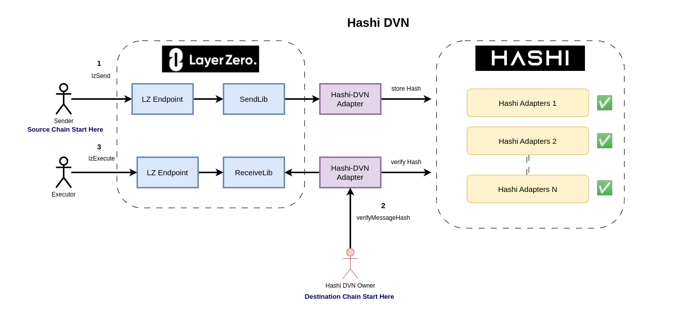
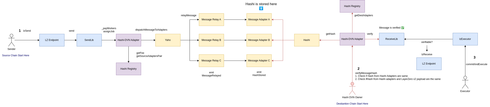

# 🍩 Hashi DVN

<figure><figcaption></figcaption></figure>

[Layer Zero v2 DVN](https://docs.layerzero.network/explore/decentralized-verifier-networks) provides customizable security stacks for developer to choose from. Developers can specify one or more DVNs for their Oapp according to their security preference. Learn how to configure DVN for your Oapp [here](https://docs.layerzero.network/contracts/configure-dvns).

[Hashi](https://crosschain-alliance.gitbook.io/hashi/), which aims to create "additive security" for cross-chain message bridging enable developers to choose which Hashi Adapters to use for their dapp's security preference. Message hash is relayed through Hashi Message Relay and stored cross-chain in Hashi Adapter contract.

This is a PoC of Hashi integration of LayerZero v2 DVN.

### Workflow

This is the end to end workflow of how a Hashi DVN Adapter will be used by an [Oapp](https://docs.layerzero.network/contracts/oapp)

<figure><figcaption></figcaption></figure>

#### Configuration from developer

In order to use Hashi DVN for your Oapp, Oapp developer need to register the DVN in the source endpoint's config.

1. Oapp calls `Endpoint.setConfig` to add HashiDVN as one of the DVN. [url](https://docs.layerzero.network/contracts/configure-dvns#set-config)

#### Configuration from Hashi

Underlying Hashi DVN is a combination of Hashi Message Relay and it's corresponding [adapter](https://github.com/gnosis/hashi/tree/main/packages/evm/contracts/adapters). The addresses and fee is registered in HashiRegistry.sol.

1. set eid to chainID mapping
2. set Hashi Registry for hashi adapters addresses and fee.

#### Source Chain

**Source chain workflow**

1. Sender calls LzEndpoint (or Oapp that will call LzEndpoint eventually).
2. LzEndpoint calls SendLib (default to ULN302)
3. SendLib calls HashiDVNAdapter `assignJob` and pay HashiDVN fee (fee is fetched from `HashiRegistry. getFee`)
4. HashiDVNAdapter calls `yaho.dispatchMessageToAdapters` to relay the messageHash.

#### Off Chain

Hashi DVN will listen to the following events and call HashiDVNAdapter.sol on destination chain.

1. Listen to `PacketSent` (to get payload) and `DVNFeedPaid` event
2. Listen to `MessageDispatched`(for messageId) event

#### Destination Chain

To verify the message, Hashi DVN owner will call `HashiDVNAdapter.verifyMessageHash()`, with `messageId` from Yaho contract, and `payload` of the corresponding LayerZero packet. There are two steps of verification:

1. 1st verification: If the messageHash stored in Hashi Adapters are matched.
2. 2nd verification: If the messageHash from 1st verification matches the corresponding LayerZero's payloadHash.

**Destination chain workflow**

1. call `HashiDVNAdapter.verifyMessageHash(messageId, payload)`
2. HashiDVNAdapterl calls `Hashi.getHash` to check if all adapters agree on the same hash for 1st verification.
3. If true, check for 2nd verificaiton and calls `ReceiveLib.verify` to set verify mapping to true.
4. Executor calls `commitAndExecute` message

### Reference

1. hashi-dvn: [https://github.com/crosschain-alliance/hashi-dvn](https://github.com/crosschain-alliance/hashi-dvn)

