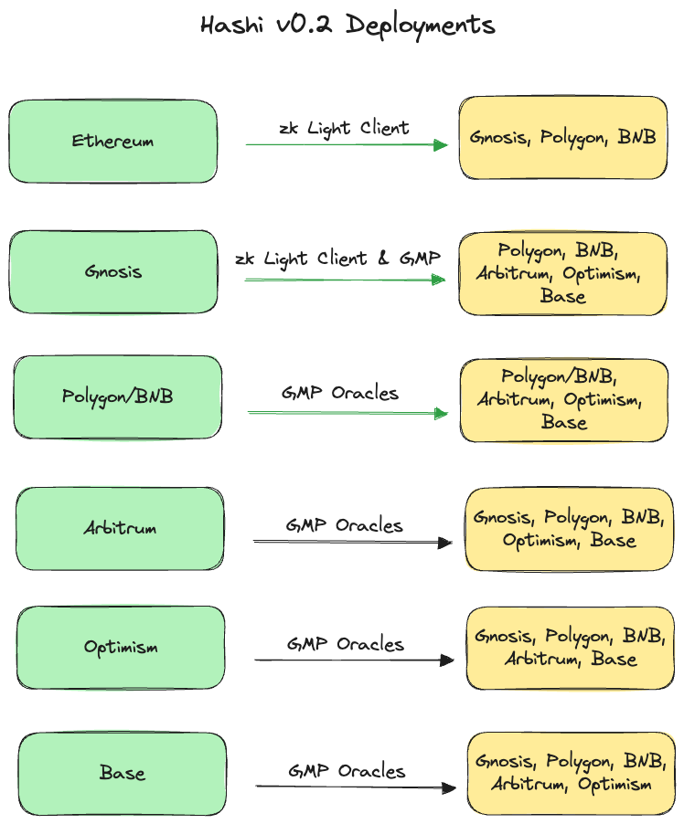

# Deployment

## Mainnet

<figure><figcaption></figcaption></figure>

Note:

1. Current deployments on mainnet involves only general message passing based oracles, while zk Light Client based oracle will be available soon. ZK light client based oracle is already available on testnet.
2. More chain connections will be available soon.

### Core contracts

<table><thead><tr><th width="123">Chain</th><th>Hashi </th><th>Header Storage</th><th>Yaho</th><th>Yaru</th></tr></thead><tbody><tr><td>Ethereum</td><td><a href="https://etherscan.io/address/0xA86bc62Ac53Dc86687AB6C15fdebC71ad51fB615">0xA86bc62Ac53Dc86687AB6C15fdebC71ad51fB615</a></td><td><a href="https://etherscan.io/address/0x117D7D593e6a7d9699a763C552BFA3177a46B957">0x117D7D593e6a7d9699a763C552BFA3177a46B957</a></td><td><a href="https://etherscan.io/address/0xbAE4Ebbf42815BB9Bc3720267Ea4496277d60DB8">0xbAE4Ebbf42815BB9Bc3720267Ea4496277d60DB8</a></td><td>100: <a href="https://etherscan.io/address/0x30f64a297cc66a873fb603d1e89d5891962c25ba">0x30f64a297cc66a873FB603d1e89D5891962C25ba</a> 42:  <a href="https://etherscan.io/address/0x5e499f1845dee19fd1efdd4a9bf17c21446f613e">0x5e499f1845dEE19FD1eFdD4A9bf17c21446f613E</a></td></tr><tr><td>Gnosis Chain</td><td><a href="https://gnosisscan.io/address/0xA86bc62Ac53Dc86687AB6C15fdebC71ad51fB615">0xA86bc62Ac53Dc86687AB6C15fdebC71ad51fB615</a></td><td><a href="https://gnosisscan.io/address/0x117D7D593e6a7d9699a763C552BFA3177a46B957">0x117D7D593e6a7d9699a763C552BFA3177a46B957</a></td><td><a href="https://gnosisscan.io/address/0xbAE4Ebbf42815BB9Bc3720267Ea4496277d60DB8">0xbAE4Ebbf42815BB9Bc3720267Ea4496277d60DB8</a></td><td>1: <a href="https://gnosisscan.io/address/0x153801d0B85D2FCAc6EA07446b6A709ce6720AC5#code">0x153801d0B85D2FCAc6EA07446b6A709ce6720AC5</a></td></tr><tr><td>Polygon</td><td><a href="https://polygonscan.com/address/0xA86bc62Ac53Dc86687AB6C15fdebC71ad51fB615">0xA86bc62Ac53Dc86687AB6C15fdebC71ad51fB615</a></td><td><a href="https://polygonscan.com/address/0x117D7D593e6a7d9699a763C552BFA3177a46B957">0x117D7D593e6a7d9699a763C552BFA3177a46B957</a></td><td><a href="https://polygonscan.com/address/0xbAE4Ebbf42815BB9Bc3720267Ea4496277d60DB8">0xbAE4Ebbf42815BB9Bc3720267Ea4496277d60DB8</a></td><td></td></tr><tr><td>BNB</td><td><a href="https://bscscan.com/address/0xbAE4Ebbf42815BB9Bc3720267Ea4496277d60DB8">0xbAE4Ebbf42815BB9Bc3720267Ea4496277d60DB8</a></td><td><a href="https://bscscan.com/address/0x79e4D1B8b8De0bC2F8A3DC477480C935C66F373E">0x79e4D1B8b8De0bC2F8A3DC477480C935C66F373E</a></td><td><a href="https://bscscan.com/address/0xC82e50cc90C84DC492B4Beb6792DEeB496d52424">0xC82e50cc90C84DC492B4Beb6792DEeB496d52424</a></td><td></td></tr><tr><td>Base</td><td><a href="https://basescan.org/address/0x79e4D1B8b8De0bC2F8A3DC477480C935C66F373E#code">0x79e4D1B8b8De0bC2F8A3DC477480C935C66F373E</a></td><td><a href="https://basescan.org/address/0xC82e50cc90C84DC492B4Beb6792DEeB496d52424#code">0xC82e50cc90C84DC492B4Beb6792DEeB496d52424</a></td><td><a href="https://basescan.org/address/0xfe2bafe5aCA5bF884F8a9148535F11B46f6D1c8f">0xfe2bafe5aCA5bF884F8a9148535F11B46f6D1c8f</a></td><td></td></tr><tr><td>Arbitrum*</td><td><a href="https://arbiscan.io/address/0x117D7D593e6a7d9699a763C552BFA3177a46B957#code">0x117D7D593e6a7d9699a763C552BFA3177a46B957</a></td><td><a href="https://arbiscan.io/address/0x6f04acf44aab94965268c0d04a0b6d5e6c03dff3#code">0x6F04acf44aab94965268c0d04a0b6D5E6C03DFF3</a></td><td><a href="https://arbiscan.io/address/0x79e4D1B8b8De0bC2F8A3DC477480C935C66F373E#code">0x79e4D1B8b8De0bC2F8A3DC477480C935C66F373E</a></td><td></td></tr><tr><td>Optimism</td><td><a href="https://optimistic.etherscan.io/address/0x79e4D1B8b8De0bC2F8A3DC477480C935C66F373E#code">0x79e4D1B8b8De0bC2F8A3DC477480C935C66F373E</a></td><td><a href="https://optimistic.etherscan.io/address/0xC82e50cc90C84DC492B4Beb6792DEeB496d52424#code">0xC82e50cc90C84DC492B4Beb6792DEeB496d52424</a></td><td><a href="https://optimistic.etherscan.io/address/0x7237bb8d1d38DF8b473b5A38eD90088AF162ad8e#code">0x7237bb8d1d38DF8b473b5A38eD90088AF162ad8e</a></td><td></td></tr><tr><td>LUKSO</td><td><a href="https://explorer.lukso.network/address/0xA86bc62Ac53Dc86687AB6C15fdebC71ad51fB615">0xA86bc62Ac53Dc86687AB6C15fdebC71ad51fB615</a></td><td><a href="https://explorer.lukso.network/address/0x117D7D593e6a7d9699a763C552BFA3177a46B957">0x117D7D593e6a7d9699a763C552BFA3177a46B957</a></td><td><a href="https://explorer.lukso.network/address/0xbAE4Ebbf42815BB9Bc3720267Ea4496277d60DB8#code">0xbAE4Ebbf42815BB9Bc3720267Ea4496277d60DB8</a></td><td>1: <a href="https://explorer.execution.mainnet.lukso.network/address/0x3f94989763A27CAeAF1f7aEF4Df2752CD5B58a5A#code">0x3f94989763A27CAeAF1f7aEF4Df2752CD5B58a5A</a></td></tr></tbody></table>

\*Arbitrum uses ArbHeaderStorage.sol instead of HeaderStorage.sol

### Oracle: Layer Zero&#x20;

Reporter dispatches blocks or messages from source chain, and Adapter stores hash on the destination chain.&#x20;

#### Reporter

<table><thead><tr><th width="138">Chain</th><th>Reporter Address</th><th>Supported Destination Chain</th></tr></thead><tbody><tr><td>Ethereum</td><td><a href="https://etherscan.io/address/0x8B5588E6fe0E34EF6cEAc15cE10812e1b86bA104">0x8B5588E6fe0E34EF6cEAc15cE10812e1b86bA104</a></td><td>Polygon, BNB, Optimism, Gnosis Chain</td></tr><tr><td>Gnosis Chain</td><td><a href="https://gnosisscan.io/address/0xA3Bc83D557E3f2dDfF4D44966A96397760159D8B#code">0xA3Bc83D557E3f2dDfF4D44966A96397760159D8B</a></td><td>Polygon, BNB, Arbitrum, Optimism, Base</td></tr><tr><td>Polygon</td><td> <a href="https://polygonscan.com/address/0x231e48AAEaAC6398978a1dBA4Cd38fcA208Ec391#code">0x231e48AAEaAC6398978a1dBA4Cd38fcA208Ec391</a></td><td>Gnosis Chain, BNB, Arbitrum, Optimism, Base</td></tr><tr><td>BNB</td><td><a href="https://bscscan.com/address/0xc9618e4d4B59570Da67b4fb0E8fC7EB40A5f8462#code">0xc9618e4d4B59570Da67b4fb0E8fC7EB40A5f8462</a></td><td>Gnosis, Polygon, Arbitrum, Optimism, Base</td></tr><tr><td>Arbitrum</td><td><a href="https://arbiscan.io/address/0xf4C84D9ced01534f235078A10E8A44A726c4b73c#code">0xf4C84D9ced01534f235078A10E8A44A726c4b73c</a></td><td>Gnosis, Polygon, BNB, Optimism, Base</td></tr><tr><td>Optimism</td><td><a href="https://optimistic.etherscan.io/address/0xB866C6dD03434d8fA792C471b454cb4E72ca35dc#code">0xB866C6dD03434d8fA792C471b454cb4E72ca35dc</a></td><td>Gnosis, Polygon, BNB, Arbitrum, Base</td></tr><tr><td>Base</td><td><a href="https://basescan.org/address/0x628329c814163E8319f8E47D0e99597A8982a300">0x628329c814163E8319f8E47D0e99597A8982a300</a></td><td>Gnosis, Polygon, BNB, Arbitrum, Optimism</td></tr></tbody></table>

#### Adapter

<table><thead><tr><th width="139">Chain</th><th>Adapter Address</th><th>Supported Source Chain</th></tr></thead><tbody><tr><td>Gnosis Chain</td><td><a href="https://gnosisscan.io/address/0x6602dc9b6bd964C2a11BBdA9B2275308D1Bbc14f">0x6602dc9b6bd964C2a11BBdA9B2275308D1Bbc14f</a></td><td>Ethereum, Polygon, BNB, Arbitrum, Optimism, Base</td></tr><tr><td>Polygon</td><td><a href="https://polygonscan.com/address/0xf4C84D9ced01534f235078A10E8A44A726c4b73c">0xf4C84D9ced01534f235078A10E8A44A726c4b73c</a></td><td>Ethereum, BNB, Arbitrum, Optimism, Base</td></tr><tr><td>BNB</td><td><a href="https://bscscan.com/address/0x97761F61736Ec2D108a1b6826f5Ee2E02d1B333e#code">0x97761F61736Ec2D108a1b6826f5Ee2E02d1B333e</a></td><td>Ethereum, Gnosis Chain, Polygon, Arbitrum, Optimism, Base</td></tr><tr><td>Arbitrum</td><td><a href="https://arbiscan.io/address/0x97761F61736Ec2D108a1b6826f5Ee2E02d1B333e">0x97761F61736Ec2D108a1b6826f5Ee2E02d1B333e</a></td><td>Gnosis Chain, Polygon, BNB, Optimism, Base</td></tr><tr><td>Optimism</td><td><a href="https://optimistic.etherscan.io/address/0x746dfa0251A31e587E97bBe0c58ED67A343280Df">0x746dfa0251A31e587E97bBe0c58ED67A343280Df</a></td><td>Ethereum, Gnosis Chain, Polygon, BNB, Arbitrum, Base</td></tr><tr><td>Base</td><td><a href="https://basescan.org/address/0x5F98c418C10132aA4D1b3c98cE4F68Ef2435e4eC#code">0x5F98c418C10132aA4D1b3c98cE4F68Ef2435e4eC</a></td><td>Gnosis Chain, Polygon, BNB, Arbitrum, Optimism</td></tr></tbody></table>

### Oracle: AMB

Source Chain: Ethereum

Reporter: [0xDbdF80c87f414fac8342e04D870764197bD3bAC7](https://etherscan.io/address/0xDbdF80c87f414fac8342e04D870764197bD3bAC7)

Destination Chain: Gnosis Chain

Adapter: [0x79e4D1B8b8De0bC2F8A3DC477480C935C66F373E](https://gnosisscan.io/address/0x79e4D1B8b8De0bC2F8A3DC477480C935C66F373E)

## Testnet

#### Sepolia

<table><thead><tr><th width="264">Contract</th><th>Address</th></tr></thead><tbody><tr><td>HeaderStorage</td><td><a href="https://sepolia.etherscan.io/address/0x48800eBEf4491C65b2172d3628DdDDC9c47fe430">0x48800eBEf4491C65b2172d3628DdDDC9c47fe430</a></td></tr><tr><td>Hashi</td><td><a href="https://sepolia.etherscan.io/address/0x78E4ae687De18B3B71Ccd0e8a3A76Fed49a02A02#code">0x78E4ae687De18B3B71Ccd0e8a3A76Fed49a02A02</a></td></tr><tr><td>Yaho</td><td><a href="https://sepolia.etherscan.io/address/0x21eAB033C7D2DF6A67AeF6C5Bda9A7F151eB9f52">0x21eAB033C7D2DF6A67AeF6C5Bda9A7F151eB9f52</a></td></tr><tr><td>Yaru (listen to Yaho from Chiado)</td><td><a href="https://sepolia.etherscan.io/address/0xBA9165973963a6E5608f03b9648c34A737E48f68#code">0xBA9165973963a6E5608f03b9648c34A737E48f68</a></td></tr><tr><td>Yaru (listen to Yaho from Lukso testnet)</td><td><a href="https://sepolia.etherscan.io/address/0x05B40580B851eA6c73CEd39d5c8aB91bAd7C4FF7#readProxyContract">0x05B40580B851eA6c73CEd39d5c8aB91bAd7C4FF7</a></td></tr><tr><td>AMBReporter</td><td><a href="https://sepolia.etherscan.io/address/0xc6755144d60548f3DD420F47Cf48DAe553bBf042#code">0xc6755144d60548f3DD420F47Cf48DAe553bBf042</a></td></tr><tr><td>CCIP Reporter</td><td><a href="https://sepolia.etherscan.io/address/0xf66871C91952b09270d223cD3A1e5Dad57b14fbC#readProxyContract">0xf66871C91952b09270d223cD3A1e5Dad57b14fbC</a></td></tr><tr><td>Wormhole Reporter </td><td><a href="https://sepolia.etherscan.io/address/0xeE8082F48e768e096c2EEC5C80DC818eb6E15858">0xeE8082F48e768e096c2EEC5C80DC818eb6E15858</a></td></tr><tr><td>AMBAdapter</td><td><a href="https://sepolia.etherscan.io/address/0x3F5929bee6A59661D6CcC9c4eB751048009CE11B#code">0x3F5929bee6A59661D6CcC9c4eB751048009CE11B</a></td></tr><tr><td>DendrETH Adapter (updates block header from Chiado)</td><td><a href="https://sepolia.etherscan.io/address/0xAd57D37179577DE2C05Ee2F210da1C6Fb2d1843b">0xAd57D37179577DE2C05Ee2F210da1C6Fb2d1843b</a></td></tr><tr><td>DendrETH Light Client</td><td><a href="https://sepolia.etherscan.io/address/0x4F8454bcb4A81D821072EfaCBECF59450956D5EC">0x4F8454bcb4A81D821072EfaCBECF59450956D5EC</a></td></tr><tr><td>Spectre Adapter (listens MessageDispatched event from Chiado's Yaho)</td><td><a href="https://eth-sepolia.blockscout.com/address/0x0b51633aE43BF1BaC0cf6149beC37096241C0Cf4?tab=txs">0x0b51633aE43BF1BaC0cf6149beC37096241C0Cf4</a></td></tr></tbody></table>

#### Chiado

<table><thead><tr><th width="265">Contract</th><th>Address</th></tr></thead><tbody><tr><td>HeaderStorage</td><td><a href="https://gnosis-chiado.blockscout.com/address/0xCA179da79CC27f8eb4cB540Eeb62f2F171521222">0xCA179da79CC27f8eb4cB540Eeb62f2F171521222</a></td></tr><tr><td>Hashi</td><td><a href="https://gnosis-chiado.blockscout.com/address/0x78E4ae687De18B3B71Ccd0e8a3A76Fed49a02A02#code">0x78E4ae687De18B3B71Ccd0e8a3A76Fed49a02A02</a></td></tr><tr><td>Yaho</td><td><a href="https://gnosis-chiado.blockscout.com/address/0x21eAB033C7D2DF6A67AeF6C5Bda9A7F151eB9f52?tab=contract">0x21eAB033C7D2DF6A67AeF6C5Bda9A7F151eB9f52</a></td></tr><tr><td>Yaru (listen to Yaho from Sepolia)</td><td><a href="https://gnosis-chiado.blockscout.com/address/0xBA9165973963a6E5608f03b9648c34A737E48f68?tab=contract">0xBA9165973963a6E5608f03b9648c34A737E48f68</a></td></tr><tr><td>AMBReporter</td><td><a href="https://gnosis-chiado.blockscout.com/address/0xc6755144d60548f3DD420F47Cf48DAe553bBf042?tab=txs">0xc6755144d60548f3DD420F47Cf48DAe553bBf042</a></td></tr><tr><td>AMBAdapter</td><td><a href="https://gnosis-chiado.blockscout.com/address/0x3F5929bee6A59661D6CcC9c4eB751048009CE11B#code">0x3F5929bee6A59661D6CcC9c4eB751048009CE11B</a></td></tr><tr><td>CCIP Adapter</td><td><a href="https://gnosis-chiado.blockscout.com/address/0x8A2A7509B98f0f21BEFF82e2520A920DB61fFa9d?tab=contract">0x8A2A7509B98f0f21BEFF82e2520A920DB61fFa9d</a></td></tr><tr><td>Wormhole Adapter </td><td><a href="https://gnosis-chiado.blockscout.com/address/0x79e4D1B8b8De0bC2F8A3DC477480C935C66F373E">0x79e4D1B8b8De0bC2F8A3DC477480C935C66F373E</a></td></tr><tr><td>DendrETH Adapter (updates block header from Sepolia)</td><td><a href="https://gnosis-chiado.blockscout.com/address/0x3CDeE1faEE13b13764C9FA3b2F0AE5aD7c3Cc2B5?tab=contract">0x3CDeE1faEE13b13764C9FA3b2F0AE5aD7c3Cc2B5</a></td></tr><tr><td>DendrETH Light Client</td><td><a href="https://gnosis-chiado.blockscout.com/address/0xbaceea8c47aa075cf944315c4ee2a029066415f8">0xbaceea8c47aa075cf944315c4ee2a029066415f8</a></td></tr><tr><td>Spectre Adapter (listens MessageDispatched event from Sepolia's Yaho)</td><td><a href="https://gnosis-chiado.blockscout.com/address/0x731e64a076027b4024ce5a4F68bA9FF0093D3c86">0x731e64a076027b4024ce5a4F68bA9FF0093D3c86</a></td></tr></tbody></table>

#### Lukso Testnet

<table><thead><tr><th width="262">Contract</th><th>Address</th></tr></thead><tbody><tr><td>HeaderStorage</td><td><a href="https://explorer.execution.testnet.lukso.network/address/0xE644169dd6E3c375772386dF39Ef6F2928Df921a#code">0xE644169dd6E3c375772386dF39Ef6F2928Df921a</a></td></tr><tr><td>Hashi</td><td><a href="https://explorer.execution.testnet.lukso.network/address/0x94c04fE1d20B0c3fcADB44C042c38C4E337Ccc49?tab=contract">0x94c04fE1d20B0c3fcADB44C042c38C4E337Ccc49</a></td></tr><tr><td>Yaho</td><td><a href="https://explorer.execution.testnet.lukso.network/address/0x58CCfAadc4E9A8f3448494281d030843dE137B8c#code">0x58CCfAadc4E9A8f3448494281d030843dE137B8c</a></td></tr><tr><td>Yaru (listen to Yaho from Sepolia)</td><td><a href="https://explorer.execution.testnet.lukso.network/address/0xBd5CE0aAE635B36Eec47018aA42e1A322CE26A54#code">0xBd5CE0aAE635B36Eec47018aA42e1A322CE26A54</a></td></tr><tr><td>DendrETH (updates block header from Sepolia) </td><td><a href="https://explorer.execution.testnet.lukso.network/address/0x17c4e6c1EF568d113d7D7CA78DefCbddBcEE05dC">0x17c4e6c1EF568d113d7D7CA78DefCbddBcEE05dC</a></td></tr><tr><td>DendrETH Light Client</td><td><a href="https://explorer.execution.testnet.lukso.network/address/0x151E75b27799c24506DB735E59AB8C59cd10d9De">0x151E75b27799c24506DB735E59AB8C59cd10d9De</a></td></tr></tbody></table>

Note:

1. Light Client based oracle doesn't require a reporter contract on source chain to dispatch Message or block headers, it only need a adapter contract on destination chain. Proof will be generated off chain and submitted to adapter contract for verification. Once verification is valid, hash will be stored.
2. Light Client based oracle: [DendrETH](https://github.com/metacraft-labs/DendrETH/), [Spectre](https://github.com/ChainSafe/Spectre), [Telepathy](https://docs.telepathy.xyz/), etc.
3. General Message Passing (GMP) oracle: [AMB](https://docs.gnosischain.com/bridges/About%20Token%20Bridges/amb-bridge), [LayerZero](https://layerzero.network/), [CCIP](https://chain.link/cross-chain), [Hyperlane](https://hyperlane.xyz/), etc.&#x20;

