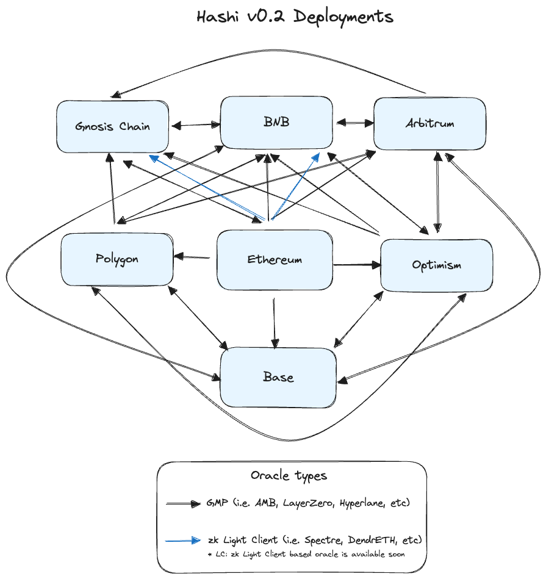

# Deployment

## Mainnet

<figure><figcaption></figcaption></figure>

Note:

1. Current deployments on mainnet involves only general message passing based oracles, while zk Light Client based oracle will be available soon.
2. More chain connections will be available soon.

### Core contracts

<table><thead><tr><th width="123">Chain</th><th>Hashi </th><th>Header Storage</th><th>Yaho</th></tr></thead><tbody><tr><td>Ethereum</td><td><a href="https://etherscan.io/address/0xA86bc62Ac53Dc86687AB6C15fdebC71ad51fB615">0xA86bc62Ac53Dc86687AB6C15fdebC71ad51fB615</a></td><td><a href="https://etherscan.io/address/0x117D7D593e6a7d9699a763C552BFA3177a46B957">0x117D7D593e6a7d9699a763C552BFA3177a46B957</a></td><td><a href="https://etherscan.io/address/0xbAE4Ebbf42815BB9Bc3720267Ea4496277d60DB8">0xbAE4Ebbf42815BB9Bc3720267Ea4496277d60DB8</a></td></tr><tr><td>Gnosis Chain</td><td><a href="https://gnosisscan.io/address/0xA86bc62Ac53Dc86687AB6C15fdebC71ad51fB615">0xA86bc62Ac53Dc86687AB6C15fdebC71ad51fB615</a></td><td><a href="https://gnosisscan.io/address/0x117D7D593e6a7d9699a763C552BFA3177a46B957">0x117D7D593e6a7d9699a763C552BFA3177a46B957</a></td><td><a href="https://gnosisscan.io/address/0xbAE4Ebbf42815BB9Bc3720267Ea4496277d60DB8">0xbAE4Ebbf42815BB9Bc3720267Ea4496277d60DB8</a></td></tr><tr><td>Polygon</td><td><a href="https://polygonscan.com/address/0xA86bc62Ac53Dc86687AB6C15fdebC71ad51fB615">0xA86bc62Ac53Dc86687AB6C15fdebC71ad51fB615</a></td><td><a href="https://polygonscan.com/address/0x117D7D593e6a7d9699a763C552BFA3177a46B957">0x117D7D593e6a7d9699a763C552BFA3177a46B957</a></td><td><a href="https://polygonscan.com/address/0xbAE4Ebbf42815BB9Bc3720267Ea4496277d60DB8">0xbAE4Ebbf42815BB9Bc3720267Ea4496277d60DB8</a></td></tr><tr><td>BNB</td><td><a href="https://bscscan.com/address/0xbAE4Ebbf42815BB9Bc3720267Ea4496277d60DB8">0xbAE4Ebbf42815BB9Bc3720267Ea4496277d60DB8</a></td><td><a href="https://bscscan.com/address/0x79e4D1B8b8De0bC2F8A3DC477480C935C66F373E">0x79e4D1B8b8De0bC2F8A3DC477480C935C66F373E</a></td><td><a href="https://bscscan.com/address/0xC82e50cc90C84DC492B4Beb6792DEeB496d52424">0xC82e50cc90C84DC492B4Beb6792DEeB496d52424</a></td></tr><tr><td>Base</td><td><a href="https://basescan.org/address/0x79e4D1B8b8De0bC2F8A3DC477480C935C66F373E#code">0x79e4D1B8b8De0bC2F8A3DC477480C935C66F373E</a></td><td><a href="https://basescan.org/address/0xC82e50cc90C84DC492B4Beb6792DEeB496d52424#code">0xC82e50cc90C84DC492B4Beb6792DEeB496d52424</a></td><td><a href="https://basescan.org/address/0xfe2bafe5aCA5bF884F8a9148535F11B46f6D1c8f">0xfe2bafe5aCA5bF884F8a9148535F11B46f6D1c8f</a></td></tr><tr><td>Arbitrum</td><td><a href="https://arbiscan.io/address/0x117D7D593e6a7d9699a763C552BFA3177a46B957#code">0x117D7D593e6a7d9699a763C552BFA3177a46B957</a></td><td><a href="https://arbiscan.io/address/0xbAE4Ebbf42815BB9Bc3720267Ea4496277d60DB8#code">0xbAE4Ebbf42815BB9Bc3720267Ea4496277d60DB8</a></td><td><a href="https://arbiscan.io/address/0x79e4D1B8b8De0bC2F8A3DC477480C935C66F373E#code">0x79e4D1B8b8De0bC2F8A3DC477480C935C66F373E</a></td></tr><tr><td>Optimism</td><td><a href="https://optimistic.etherscan.io/address/0x79e4D1B8b8De0bC2F8A3DC477480C935C66F373E#code">0x79e4D1B8b8De0bC2F8A3DC477480C935C66F373E</a></td><td><a href="https://optimistic.etherscan.io/address/0xC82e50cc90C84DC492B4Beb6792DEeB496d52424#code">0xC82e50cc90C84DC492B4Beb6792DEeB496d52424</a></td><td><a href="https://optimistic.etherscan.io/address/0x7237bb8d1d38DF8b473b5A38eD90088AF162ad8e#code">0x7237bb8d1d38DF8b473b5A38eD90088AF162ad8e</a></td></tr></tbody></table>

### Oracle: Layer Zero&#x20;

Reporter dispatches blocks or messages from source chain, and Adapter stores hash on the destination chain.&#x20;

#### Reporter

<table><thead><tr><th width="138">Chain</th><th>Reporter Address</th><th>Supported Destination Chain</th></tr></thead><tbody><tr><td>Ethereum</td><td> <a href="https://etherscan.io/address/0xbc5f67da5347cd4304e9623bc86e71a874287ea1">0xbc5f67da5347cd4304e9623bc86e71a874287ea1</a></td><td>Polygon, BNB, Arbitrum, Optimism, Base</td></tr><tr><td>Polygon</td><td> <a href="https://polygonscan.com/address/0x147Abe85112154b3D5bF55d10cEE64aeD0279479#code">0x147Abe85112154b3D5bF55d10cEE64aeD0279479</a></td><td>Gnosis, BNB, Arbitrum, Optimism, Base</td></tr><tr><td>BNB</td><td><a href="https://bscscan.com/address/0x3E80f3987A570eC1C5c91e982dc88FCC01f4aA11#code">0x3E80f3987A570eC1C5c91e982dc88FCC01f4aA11</a></td><td>Gnosis, Polygon, Arbitrum, Optimism, Base</td></tr><tr><td>Arbitrum</td><td><a href="https://arbiscan.io/address/0x3da176b43604Aacf6178128865AfccB21ee0F943#code">0x3da176b43604Aacf6178128865AfccB21ee0F943</a></td><td>Gnosis, Polygon, BNB, Optimism, Base</td></tr><tr><td>Optimism</td><td><a href="https://optimistic.etherscan.io/address/0xd60899683383E53AB8807F0cD34e3a6Dd6dF66a3#code">0xd60899683383E53AB8807F0cD34e3a6Dd6dF66a3</a></td><td>Gnosis, Polygon, BNB, Arbitrum, Base</td></tr></tbody></table>

#### Adapter

<table><thead><tr><th width="139">Chain</th><th>Adapter Address</th><th>Supported Source Chain</th></tr></thead><tbody><tr><td>Gnosis Chain</td><td><a href="https://gnosisscan.io/address/0xC82e50cc90C84DC492B4Beb6792DEeB496d52424">0xC82e50cc90C84DC492B4Beb6792DEeB496d52424</a></td><td>Polygon, BNB, Arbitrum, Optimism</td></tr><tr><td>Polygon</td><td><a href="https://polygonscan.com/address/0x998dA7f6cF98541E4F4469cc9d53B9374F186591#writeContract">0x998dA7f6cF98541E4F4469cc9d53B9374F186591</a></td><td>Ethereum, BNB, Arbitrum, Optimism</td></tr><tr><td>BNB</td><td><a href="https://bscscan.com/address/0xDbdF80c87f414fac8342e04D870764197bD3bAC7#writeContract">0xDbdF80c87f414fac8342e04D870764197bD3bAC7</a></td><td>Ethereum, Polygon,Arbitrum, Optimism</td></tr><tr><td>Arbitrum</td><td><a href="https://arbiscan.io/address/0xA86bc62Ac53Dc86687AB6C15fdebC71ad51fB615#writeContract">0xA86bc62Ac53Dc86687AB6C15fdebC71ad51fB615</a></td><td>Ethereum, Polygon, BNB, Optimism</td></tr><tr><td>Optimism</td><td><a href="https://optimistic.etherscan.io/address/0xA86bc62Ac53Dc86687AB6C15fdebC71ad51fB615#code">0xA86bc62Ac53Dc86687AB6C15fdebC71ad51fB615</a></td><td>Ethereum, Polygon, BNB, Arbitrum</td></tr><tr><td>Base</td><td><a href="https://basescan.org/address/0xA86bc62Ac53Dc86687AB6C15fdebC71ad51fB615#code">0xA86bc62Ac53Dc86687AB6C15fdebC71ad51fB615</a></td><td>Ethereum, Polygon, BNB, Arbitrum, Optimism</td></tr></tbody></table>

### Oracle: AMB

Source Chain: Ethereum

Reporter: [0xDbdF80c87f414fac8342e04D870764197bD3bAC7](https://etherscan.io/address/0xDbdF80c87f414fac8342e04D870764197bD3bAC7)

Destination Chain: Gnosis Chain

Adapter: [0x79e4D1B8b8De0bC2F8A3DC477480C935C66F373E](https://gnosisscan.io/address/0x79e4D1B8b8De0bC2F8A3DC477480C935C66F373E)

## Testnet

#### Sepolia

| Contract      | Address                                                                                                                            |
| ------------- | ---------------------------------------------------------------------------------------------------------------------------------- |
| HeaderStorage | 0x48800eBEf4491C65b2172d3628DdDDC9c47fe430                                                                                         |
| Hashi         | [0x78E4ae687De18B3B71Ccd0e8a3A76Fed49a02A02](https://sepolia.etherscan.io/address/0x78E4ae687De18B3B71Ccd0e8a3A76Fed49a02A02#code) |
| Yaho          | [0x21eAB033C7D2DF6A67AeF6C5Bda9A7F151eB9f52](https://sepolia.etherscan.io/address/0x21eAB033C7D2DF6A67AeF6C5Bda9A7F151eB9f52)      |
| Yaru          | [0xBA9165973963a6E5608f03b9648c34A737E48f68](https://sepolia.etherscan.io/address/0xBA9165973963a6E5608f03b9648c34A737E48f68#code) |
| AMBReporter   | [0xc6755144d60548f3DD420F47Cf48DAe553bBf042](https://sepolia.etherscan.io/address/0xc6755144d60548f3DD420F47Cf48DAe553bBf042#code) |
| AMBAdapter    | [0x3F5929bee6A59661D6CcC9c4eB751048009CE11B](https://sepolia.etherscan.io/address/0x3F5929bee6A59661D6CcC9c4eB751048009CE11B#code) |

#### Chiado

| Contract      | Address                                                                                                                                            |
| ------------- | -------------------------------------------------------------------------------------------------------------------------------------------------- |
| HeaderStorage | 0xCA179da79CC27f8eb4cB540Eeb62f2F171521222                                                                                                         |
| Hashi         | [0x78E4ae687De18B3B71Ccd0e8a3A76Fed49a02A02](https://gnosis-chiado.blockscout.com/address/0x78E4ae687De18B3B71Ccd0e8a3A76Fed49a02A02#code)         |
| Yaho          | [0x21eAB033C7D2DF6A67AeF6C5Bda9A7F151eB9f52](https://gnosis-chiado.blockscout.com/address/0x21eAB033C7D2DF6A67AeF6C5Bda9A7F151eB9f52?tab=contract) |
| Yaru          | [0xBA9165973963a6E5608f03b9648c34A737E48f68](https://gnosis-chiado.blockscout.com/address/0xBA9165973963a6E5608f03b9648c34A737E48f68?tab=contract) |
| AMBReporter   | [0xc6755144d60548f3DD420F47Cf48DAe553bBf042](https://gnosis-chiado.blockscout.com/address/0xc6755144d60548f3DD420F47Cf48DAe553bBf042?tab=txs)      |
| AMBAdapter    | [0x3F5929bee6A59661D6CcC9c4eB751048009CE11B](https://gnosis-chiado.blockscout.com/address/0x3F5929bee6A59661D6CcC9c4eB751048009CE11B#code)         |

